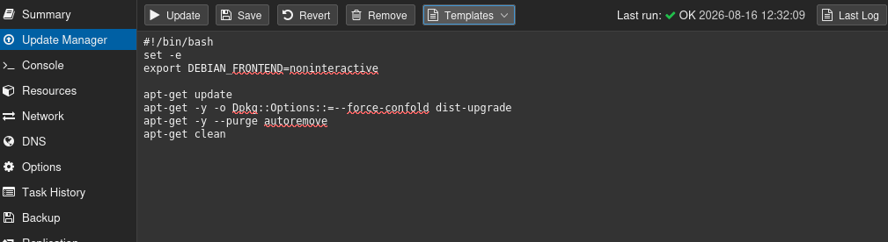
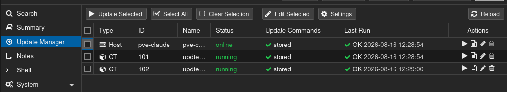
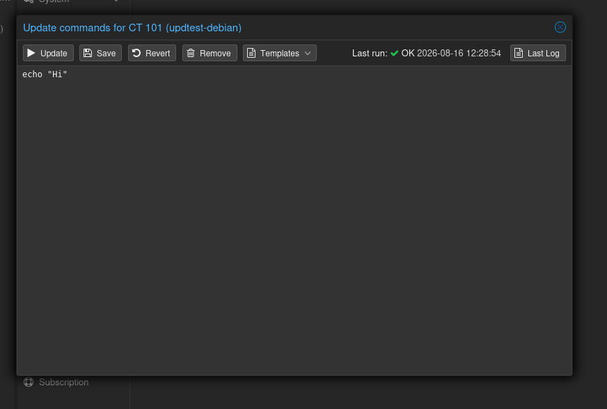

# pve-update-manager

An **Update Manager** tab for Proxmox VE — one per LXC container, one per node,
one for the datacenter. You write the update commands, the addon runs them as a
normal Proxmox task and records how each target's last run ended.







## Features

- **Container tab** — a text box with that container's commands and an *Update*
  button. Nothing is generated or guessed from the distribution.
- **Node tab** — the host and every container on it in one list, with each
  target's last state and a 📄 to its log. Tick some and *Update Selected*, or
  press ▶ / ✎ / 🗑 on a single row.
- **Datacenter tab** — the same list across the whole cluster.
- **Edit Selected** — write the same script to many targets at once; the dialog
  says how many of them already have one.
- **Templates menu** — cluster-wide starting points to paste in, editable and
  resettable.
- **Snapshot before an update**, where the storage can take one, with a
  retention count. On by default.
- **Scheduled runs** — a systemd calendar event per node, serial or parallel.
- **Datacenter-wide settings** — write one settings page to every node.
- **Start stopped containers** for their update and stop them again afterwards.
- **Timeout that kills**, per target, plus an 8 MiB ceiling on what one target
  may write to the task log.
- **Nothing gets switched off mid-update** — the container carries a `mounted`
  config lock and the node holds a systemd shutdown inhibitor for the whole job.
- **Destroy cleanup** — Proxmox' destroy dialog offers to delete the stored
  commands with the container, ticked by default.

## Install

Download the `.deb` from [Releases](../../releases):

```sh
sudo apt install ./pve-update-manager_*_all.deb
```

Then reload the web interface. `Architecture: all` — nothing is compiled, so the
same file installs on amd64 and arm64.

```sh
sudo apt remove pve-update-manager      # keeps the stored scripts
sudo apt purge  pve-update-manager      # also deletes /etc/pve/pve-update-manager
```

Good to know: the `<script>` tag carries a version derived from the interface
file's contents, so an upgrade invalidates the browser cache by itself.

## Settings

**Node → Update Manager → Settings**, or the same window from the Datacenter tab
for every node at once. Containers have no settings of their own; they follow
the node they run on.

| Setting | Default | What |
| --- | --- | --- |
| `snapshot_before` | on | snapshot a container before updating it |
| `snapshot_keep` | 3 | how many of *our* snapshots to keep per container (1–100) |
| `parallel_manual` | off | start all targets at once on *Update Selected* |
| `timeout` | 14400 | seconds before a target's update is killed (10–86400) |
| `start_stopped` | off | start a stopped container for its update, stop it after |
| `schedule_enabled` | off | run the selected targets on a schedule |
| `schedule_time` | `03:00` | systemd calendar event |
| `schedule_parallel` | off | start all targets at once on a scheduled run |
| `schedule_host` | off | include the node's own script in scheduled runs |
| `schedule_vmids` | — | which containers the schedule runs |

Datacenter-wide saves write every key except `schedule_vmids` and `last_run`,
which stay per node. `Sys.Console` is checked on every node before any of them
is written.

## Snapshots

| Situation | What happens |
| --- | --- |
| storage can snapshot | `updmgr-<date>-<time>` before the run; ours above the retention count are removed after it |
| storage cannot | updated anyway, the log says so |
| snapshot fails | the target fails before the update starts |

Good to know: capability is asked per container via Proxmox' own
`has_feature('snapshot')` — ZFS, LVM-thin, RBD and btrfs qualify, a directory
storage does not. Only names matching `updmgr-<8 digits>-<6 digits>` are ever
removed, and age comes from Proxmox' `snaptime`, not from the name.

## Scheduled runs

```
03:00               every day at 03:00
mon..fri 02:30      weekdays only
*/8:00              every eight hours
sat 04:00           once a week
```

```sh
pve-update-manager-schedule status   # the settings, and when they fire next
pve-update-manager-schedule run      # run if due - what the timer does
```

`pve-update-manager.timer` asks every five minutes whether the next occurrence
has passed; the schedule is not encoded in the unit, so a change takes effect
immediately. Due-ness is measured from `last_run`, which is stamped before the
work starts. A run is skipped while any of its targets is still updating.

## Templates

Cluster-wide, editable, and shared by every node. Until something is changed it
is the built-in set; the first change writes the whole set to
`templates.conf`. **Reset to Defaults** deletes that file.

Shipped: apt, apt major release upgrade, apk, pacman, dnf.

```sh
pvesh get    /cluster/updatemgr/templates
pvesh set    /cluster/updatemgr/templates --name 'House style' --script "$(cat tpl.sh)"
pvesh set    /cluster/updatemgr/templates --name 'New name' --script "$(cat tpl.sh)" --oldname 'House style'
pvesh delete /cluster/updatemgr/templates --name 'House style'
pvesh create /cluster/updatemgr/templates/reset
```

File format — one block per entry, script indented by exactly one space, an
empty script line written as a single space:

```
name: Debian / Ubuntu (apt)
 #!/bin/bash
 set -e
 export DEBIAN_FRONTEND=noninteractive
 
 apt-get update
```

Good to know:

- Editing needs `Sys.Modify` on `/`. **Reading is open to every logged-in
  user** — keep credentials and internal hostnames out of a template.
- Reset is `POST templates/reset`, not a `DELETE` with the name left off.
- Once you edit one entry, improved defaults for the others stop arriving until
  you reset.
- The **major release upgrade** template handles both distributions: Ubuntu via
  `do-release-upgrade`, Debian by rewriting the codename in `sources.list` and
  in deb822 `.sources`, then minimal-then-full upgrade. The target release is a
  variable at the top. It does not reboot. On Ubuntu, *no new release available*
  is reported as a successful run.

## Which shell runs your commands

The first line may be a shebang and picks the interpreter; the default is
`/bin/sh`. The script is passed as a single argument (`sh -c '<script>'`), never
re-parsed by another shell. On the node it runs directly, in a container through
`pct exec` — a stopped container is skipped unless `start_stopped` is on.

## Permissions

| Action | Needs |
| --- | --- |
| see a container's tab and script | `VM.Audit` on `/vms/<vmid>` |
| edit a container's script | `VM.Config.Options` on `/vms/<vmid>` |
| run a container's script | `VM.Console` on `/vms/<vmid>` |
| see the node tab | `Sys.Audit` on `/nodes/<node>` |
| edit the host script | `Sys.Modify` on `/nodes/<node>` |
| run the host script | `Sys.Console` on `/nodes/<node>` |
| see the datacenter tab | `Sys.Audit` or `VM.Audit` somewhere |
| edit templates | `Sys.Modify` on `/` |
| write settings to every node | `Sys.Console` on every node |

The datacenter list is built from Proxmox' cluster resource index, so it shows
exactly what the user may already see. The host row is never picked by *Select
All Containers*.

## API

```sh
# a container's commands
pvesh set    /nodes/pve/lxc/101/updatemgr/script --script "$(cat update.sh)"
pvesh get    /nodes/pve/lxc/101/updatemgr/script
pvesh delete /nodes/pve/lxc/101/updatemgr/script
pvesh delete /nodes/pve/lxc/101/updatemgr/script --purge 1   # also the last-run state

# the node's own commands: same three, under /nodes/pve/updatemgr/script

# run
pvesh create /nodes/pve/lxc/101/updatemgr/run
pvesh create /nodes/pve/updatemgr/run --vmids 101,102 --host 1

# what is there, and how it last went
pvesh get /nodes/pve/updatemgr/targets
pvesh get /cluster/updatemgr/targets

# settings
pvesh get /nodes/pve/updatemgr/settings
pvesh set /nodes/pve/updatemgr/settings --schedule_enabled 1 --schedule_time 03:00
pvesh get /cluster/updatemgr/settings
pvesh set /cluster/updatemgr/settings --snapshot_before 1 --snapshot_keep 5
```

Good to know:

- `run` returns a UPID; it also lands in the target's `last_upid`, which is what
  the 📄 button opens.
- A container with no script stored starts no task and is recorded as `skipped`.
- Storing an empty script is refused; removing is its own operation.
- Removing a script keeps the recorded last run. Wipe it with
  `rm /etc/pve/pve-update-manager/lxc-101.state`, or use `--purge 1`.
- There is no cluster-wide `run`: the UI fires one `POST` per node in parallel.
- A single container goes to its own endpoint, so its task is typed `ctupdate`
  and reads *CT 102 — Update Manager* in the task list.

## Files

| Path | What |
| --- | --- |
| `/etc/pve/pve-update-manager/lxc-<vmid>.conf` | a container's update commands |
| `/etc/pve/pve-update-manager/node-<node>.conf` | the host's update commands |
| `/etc/pve/pve-update-manager/*.state` | how that target's last run ended |
| `/etc/pve/pve-update-manager/settings-<node>.conf` | that node's settings |
| `/etc/pve/pve-update-manager/templates.conf` | the Templates menu, once changed |
| `/usr/share/pve-manager/js/pve-update-manager.js` | the web interface code |
| `/usr/share/perl5/PVE/UpdateManager/*.pm` | the API |
| `/usr/sbin/pve-update-manager-hooks` | applies / removes the integration |
| `/usr/sbin/pve-update-manager-schedule` | what the timer runs |
| `/usr/lib/systemd/system/pve-update-manager.timer` | five-minute due check |
| `/var/lib/pve-update-manager/backup/` | copies taken before editing |

Everything under `/etc/pve` is cluster-replicated and plain text:

```sh
$ cat /etc/pve/pve-update-manager/lxc-102.state
exit=0
finished=1786817301
started=1786817167
state=ok
upid=UPID:pve:000798A0:011ACA05:6A80AA7B:updatemgr:pve:root@pam:
```

Good to know: the state file is not the task log. Task logs rotate away, this
does not.

## How it hooks into Proxmox

Four one-line edits, idempotent and reversible:

| File | Line added |
| --- | --- |
| `/usr/share/pve-manager/index.html.tpl` | a versioned `<script>` tag after `pvemanagerlib.js` |
| `/usr/bin/pvedaemon` | `BEGIN { eval { require PVE::UpdateManager::Inject; }; }` |
| `/usr/bin/pveproxy` | the same |
| `/usr/bin/pvesh` | the same |

```sh
pve-update-manager-hooks status    # hooked / plain, per file
pve-update-manager-hooks apply     # (re)apply and reload the daemons
pve-update-manager-hooks revert    # remove and reload
```

Good to know:

- `pvemanagerlib.js` is **not** patched. The tabs come from an override of
  `PVE.panel.Config.initComponent`, the API from `register_method({subclass})`
  at daemon startup, the destroy tick from the `additionalItems` and
  `apiCallDone` hooks of `PVE.window.SafeDestroyGuest`.
- All three Perl entry points need the line, `pvesh` included — without it
  `pvesh` answers *no handler defined* while the web interface works.
- It must be `BEGIN`, above the entry-point `use`. `PERL5OPT` is no substitute:
  `pvedaemon` and `pveproxy` run under `-T`, and taint mode ignores it.
- A dpkg trigger re-applies everything after a `pve-manager` upgrade.
- Before a Perl file is edited a copy goes to
  `/var/lib/pve-update-manager/backup/`, and the result must pass `perl -Tc` or
  the backup goes straight back.

## Building

```sh
make check     # shellcheck, perl -c against stubs, node --check
make test      # the suite: unit tests plus the hook script against fixtures
make deb       # deb-out/pve-update-manager_<version>_all.deb
```

The tests need no Proxmox — the Perl modules run against stubs in `tests/stubs`,
and the hook script runs for real against copies of a real `index.html.tpl`, a
taint-mode `pvedaemon` and a non-taint `pvesh` in a tmpdir.

## Licence

AGPL-3.0-or-later, see [LICENSE](../LICENSE) — the same licence Proxmox VE uses.
This addon imports Proxmox' Perl modules and subclasses `PVE::RESTHandler`, so
it is a derivative of AGPL-licensed code and cannot be more permissive.

### Copyright

```
pve-update-manager - an Update Manager tab for Proxmox VE
Copyright (C) 2026 Lukas

This program is free software: you can redistribute it and/or modify it under
the terms of the GNU Affero General Public License as published by the Free
Software Foundation, either version 3 of the License, or (at your option) any
later version. See the LICENSE file for the full text.
```

That notice is what a fork has to keep. It lives here rather than at the top of
`LICENSE`, because GitHub only recognises a licence when that file holds the
verbatim upstream text — a prepended header makes it report "Unknown license".
